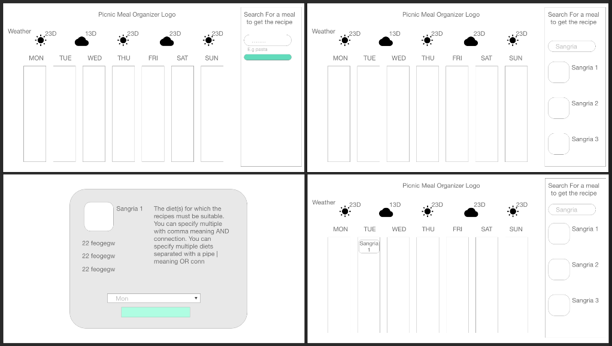
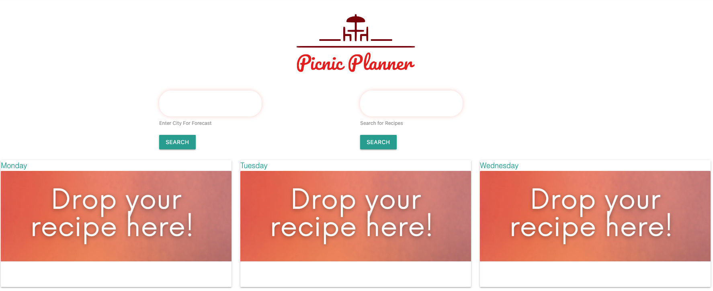
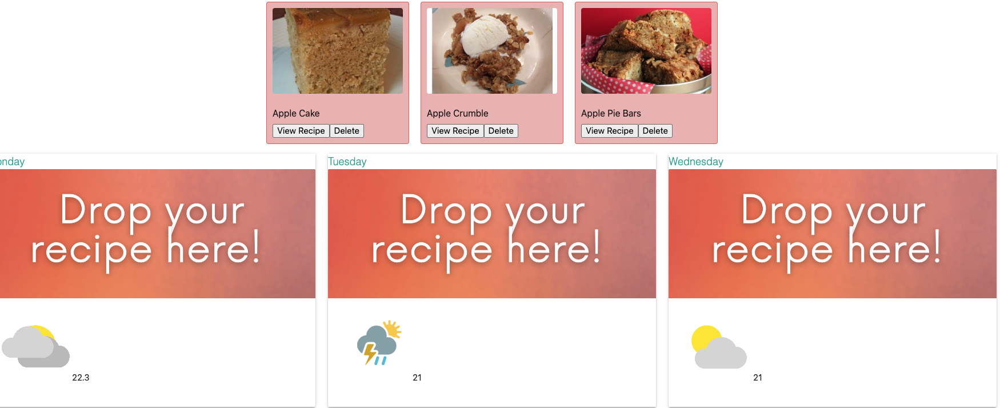
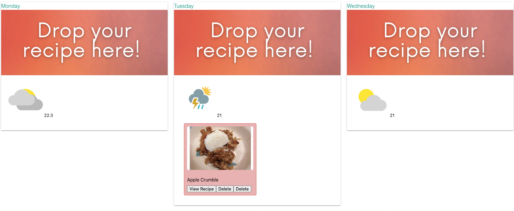

# picnic_meal_planner

Find recipes for your picnic while you check the weather forecast!

## User Story

**AS A Canadian** that enjoys summer and trying out new recipes
**I WANT** to plan me picnic days to be sunny and full of new culinary explorations
**SO THAT** I can enjoy my summer season to the fullest

## What does the app do

- Display a 7-day planner
- Show the weather forecast of the 7-day planner
- Adjust the weather forecast based on a new city the user wants to search
- Display three recipes from an ingredient of my choice
- Display detail information of recipes like ingredients, instructions and description
- Save the recipe into a specific day choosen by the user (Drag and Drop)
- Display the recipe inside the 7-day planner
- Store the recipe(s) on the specific day(s) on localStorage so is available even if the users closes the window

## Wireframing

Rough concept of the userflow and app low fidelity prototype

## Environments

View our code on GitHub pages https://felipewithf.github.io/picnic_meal_planner/

## Testing

To test our app please try the following:

- Type any city to display the forecast of the week
- Type an ingredient to find recipes
- View your favorite recipe and drag it to any day of the week you want to store it
- Delete or move the recipe to another day
- Refresh your browser and see the saved recipes

## Tech Information

We used the following libraries and API

### Front End Framework

- Materialize  
  https://materializecss.com/

### Javascript Libraries

- DayJS  
  https://day.js.org/en/
- Jquery  å
  https://jquery.com/

### Third-Party APIs

- WeatherBit (Weather Forecast)  
  https://www.weatherbit.io/
- Spoonacular (Food Recipes)  
  https://spoonacular.com/food-api

## Final Design

å